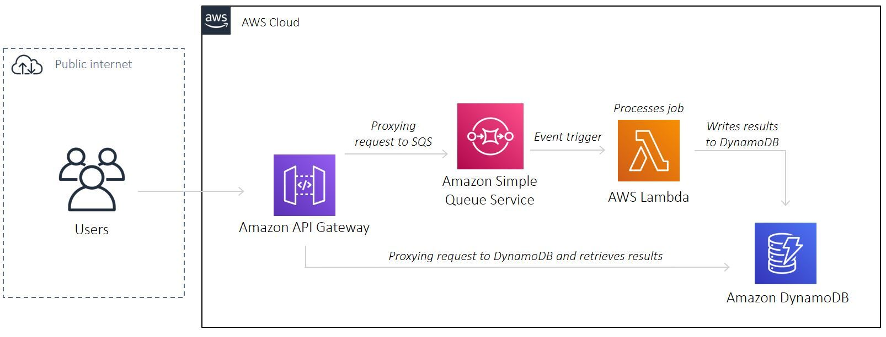

# AWS SQS Jobs Processer

A reference project to deploy a serverless, jobs processer on AWS with Terraform



## Pre-requisite

- Make sure you have installed [Terraform](https://learn.hashicorp.com/tutorials/terraform/install-cli), [AWS CLI](https://docs.aws.amazon.com/cli/latest/userguide/install-cliv2-mac.html#cliv2-mac-prereq), and configured a `default` AWS CLI profile (see doc [here](https://docs.aws.amazon.com/cli/latest/userguide/cli-configure-quickstart.html#cli-configure-quickstart-profiles))

```bash
terraform -help # prints Terraform options
which aws # prints /usr/local/bin/aws
aws --version # prints aws-cli/2.0.36 Python/3.7.4 Darwin/18.7.0 botocore/2.0.0
aws configure # configure your AWS CLI profile
```

## Configuration

- Create an [S3 bucket](https://www.terraform.io/docs/language/settings/backends/s3.html) to store Terraform state. Populate bucket name in `01-main.tf`

- Create another S3 bucket to store Lambda functions build artifacts:

```bash
aws s3api create-bucket --bucket=<YOUR_UNIQUE_BUCKET_NAME> --region=<DEFAULT_REGION>
```

- Populate `terraform.tfvars`:

```bash
default_region      = "<YOUR_AWS_DEFAULT_REGION>"
app_name            = "<GIVE_YOUR_APP_A_NAME!>"
environment         = "<ENVIRONMENT_NAME>"
```

## Deploy Lambda package

- Navigate to `/deploy/lambdas/<FUNCTION_NAME>`
- Create a `.zip` file:

```bash
zip -r <FUNCTION_NAME>.zip .
```

- Uploads Lambda artifact to S3 bucket:

```bash
aws s3 cp <FUNCTION_NAME>.zip s3://<BUCKET_NAME>/v1.0.0/<FUNCTION_NAME>.zip
```

## Update Lambda package

- Update the `deploy/lambdas/processQueue/updateFunction.sh` shell script with correct values i.e. Amazon S3 bucket name, and key. See documentation on AWS CLI `update-function-code` [here](https://awscli.amazonaws.com/v2/documentation/api/latest/reference/lambda/update-function-code.html)

- Run the script:

```bash
sh deploy/lambdas/processQueue/updateFunction.sh
```

## Deploy

```bash
cd deploy # change to deploy directory
terraform init # initialises Terraform
terraform apply # deploys AWS stack. See output for API url
terraform destroy # destroys AWS stack
```

## Usages

- Make a `POST` request to `<API_ENDPOINT>/jobs` to trigger a job
- Make a `GET` request to `<API_ENDPOINT>/jobs` to retrieve all jobs
- Make a `GET` request to `<API_ENDPOINT>/jobs/<JOB_ID>` to retrieve a specific job

## Contributing

Pull requests are welcome. For major changes, please open an issue first to discuss what you would like to change.

Please make sure to update tests as appropriate.

## License

[MIT](https://choosealicense.com/licenses/mit/)
